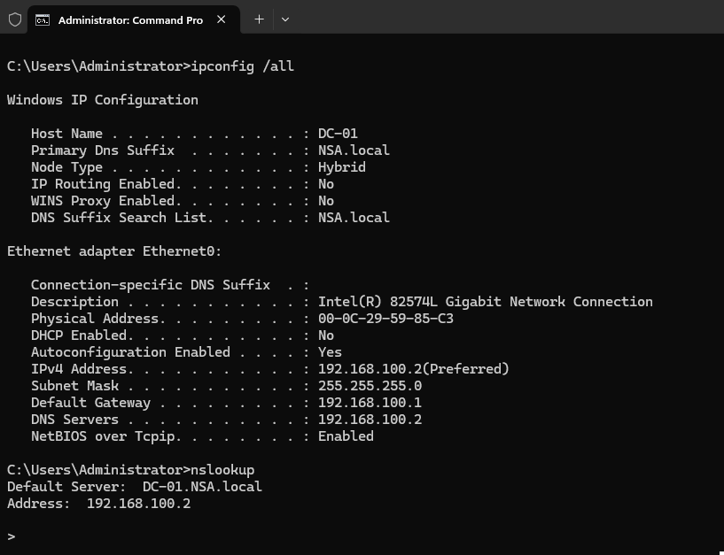

# SOP: Setting Up an On-Premises Domain Controller  
**College:** Manitoba Institute of Trades and Technology (MITT)  
**Course:** Network and System Administration  
**Version:** 1.4  
**Written By:** Aaron Queskekapow, Ravneet Kaur, Harpreet Singh, Jaskirat Kaur Brar  
**Date:** 03/27/2025  

## Approval

| Name              | Role     | Date Approved |
|-------------------|----------|----------------|
| Aaron Queskekapow | Lead / Document Owner | 03/27/2025     |
| Ravneet Kaur | Co-Editor | 03/28/2025     |
| Harpreet Singh | Visual Designer | 03/28/2025     |
| Jaskirat Kaur Brar | Quality Assurance | 03/28/2025     |

## Revision

This SOP has a revision history to keep track of any changes made over time. If anything needs to be updated later, it'll be added to the table below. If a change causes problems or doesn’t work out, we can go back to an earlier version with approval.

### Revision History

| Version | Date       | Description                | Author              |
|---------|------------|----------------------------|---------------------|
| 1.0     | 03/27/2025 | Initial release of the SOP | Aaron Queskekapow   |
| 1.1     | 03/28/2025 | Grammar corrections. | Aaron Queskekapow   |
| 1.2     | 03/28/2025 | Made changes network configuration. | Aaron Queskekapow |
| 1.3     | 03/28/2025 | Made changes to step 4. | Ravneet Kaur |

### Accountability Matrix

| Role                     | Name               | Responsibility                                |
|--------------------------|--------------------|-----------------------------------------------|
| Domain Administrator     | Aaron Queskekapow  | Set up and configured the domain controller   |
| Network Technician       | Aaron Queskekapow  | Configured IP settings, NAT, and DHCP         |
| Client Support           | Ravneet Kaur       | Assisted with client PC setup and domain join |
| System Verifier          | Jaskirat Kaur Brar | Tested domain login and DNS resolution        |
| Configuration Assistant  | Harpreet Singh     | Helped validate network configuration steps   |
| Documentation Lead       | Aaron Queskekapow  | Wrote and structured the SOP                  |

## Purpose

This SOP is part of our final assignment and demonstrates installing and configuring Windows Server 2025 with Desktop Experience (GUI) as an on-premises domain controller. It shows how to set up core services like Active Directory, DNS, and DHCP on a physical machine to run a domain and manage devices on the network.

## Application

This SOP is intended for IT administrators and technicians tasked with deploying Windows Server 2025 in an on-premises environment. It provides clear guidance for setting up a secure and functional domain controller using NAT networking. The steps ensure the system is prepared to support domain joined client machines.

## Scope

This SOP covers the complete setup of an on-premises domain controller running Windows Server 2025 with a graphical interface. It includes configuring a static IP address, installing necessary roles and features (AD DS, DNS, DHCP), promoting the server to a domain controller and verifying proper operation of all services.

## Responsibilities

- **Group Members**: Collaboratively handle server installation, network configuration, documentation, testing, and submission. Roles may be shared or rotated.

## Network Configuration

| Component          | IP Address Range            | Description                          |
|--------------------|-----------------------------|--------------------------------------|
| **Domain Name**    | NSA.local                   | Active Directory domain name         |
| **Network Address**| 192.168.100.1/24              | NAT-based local network              |
| **DC-01**          | 192.168.100.2/24              | Domain Controller and DNS server     |
| **DNS Server**     | 192.168.100.2                 | Self-assigned DNS                    |
| **Reserved Range**  | 192.168.100.3 – 192.168.100.20       | Reserved for future static servers    |
| **DHCP Pool**       | 192.168.100.21 – 192.168.100.200     | Dynamic IP range for client devices   |
| **Future Reserved** | 192.168.100.201 – 192.168.100.254    | Optional reserved range for future IPs|

## Step-by-Step Procedure

### Step 1: Initial Server Setup
1. Power on the physical server with Windows Server 2025 installation media.
2. Complete initial setup steps:
   - Choose `Windows Server 2025 Standard (Desktop Experience)`
       
   - Set the Administrator password
       
3. Log in as Administrator.
4. Rename the machine to `DC-01`:
   - Open **Server Manager**
   - Click on **Local Server** in the left-hand menu. 
   - Next to **Computer Name**, click the current name (e.g., `WIN-6OG0DUBK8TD`)
       
   - Click the **Change** button  
       
   - Enter the hostname `DC-01` and click **OK**
   - Restart the server when prompted to apply the change

### Step 2: Configure Static IP Address
1. Click **Start > Settings > Network & Internet > Ethernet**
2. Select the connected network, scroll down to **IP assignment**, and click **Edit**
     
3. Change to **Manual**, enable **IPv4**, and enter:
   - IP Address: `192.168.100.2`
   - Subnet Mask: `255.255.255.0`
   - Gateway: `192.168.100.1`
   - Preferred DNS: `192.168.100.2`
4. Click **Save** and verify connectivity

### Step 3: Install AD DS Role
1. Click **Start > Server Manager**
2. Click **Manage > Add Roles and Features**  
     
3. (Before You Begin) Click **Next**
4. (Installation Type) Select **Role-based or feature-based installation** and click **Next**
5. (Server Selection) Choose the local server(DC-01) and click **Next**
6. (Server Roles) Check **Active Directory Domain Services** and click **Next**
     
7. (Features) click **Next**
8. (AD DS) click **Next**
9. (Confirmation) click **Install**  
     
10. Wait for the install to complete and **Close**

### Step 4: Promote to Domain Controller
1. In Server Manager, click the yellow flag > **Promote this server to a domain controller**
     
2. (Deployment Configuration) Choose **Add a new forest**, enter `NSA.local` and click **Next**
     
3. (Domain Controller Options) Enter DSRM (Directory Services Restore Mode) password and click **Next**
     
4. (Deployment Configuration - DNS Options) Click **Next**
5. (Additional Options) Leave the default NetBIOS name or customize if needed
6. Continue through the wizard and click **Install** after prerequisites check  
   ** > **Properties**  
    
- Ensure **Preferred DNS server** is set to `192.168.100.2`
    
  - If not, change it  
  - If correct, continue to the next step

### Step 5: Verify DNS
1. Open **Server Manager > Tools > DNS**
2. Verify **Forward Lookup Zones** contains `NSA.local`  
     
3. Create a **Reverse Lookup Zone** for `192.168.100.x`
   - **Right-Click** Reverse Lookup Zone > New Zone  
       
   - **Choose** Primary Zone, Check "`Store the zone in...`" and Click **Next**
   - Click **Next**
   - IPv4 Reverse Lookup Zone and Click **Next**
   - Network ID: Enter `192.168.100.x` and Click **Next**
   - **Choose** Allow only secure dynamic updates(recomended for Active Directory) and click **Next**  
       
   - Click **Finish**
4. Add a PTR(Pointer Record) in Reverse Lookup Zone for `192.168.100.x`
   - **Right-Click** the Reverse Lookup Zone > New Pointer(PTR)  
       
   - Enter `192.168.100.2` for Host IP Address and click **OK**  
       
5. (Optional) Verify DNS
   - Start > type `cmd`, press Enter, then type `nslookup` and hit Enter  
       

### Step 6: Install DHCP Role
1. Click **Start > Server Manager**
2. Click **Manage > Add Roles and Features**  
     
3. (Before You Begin) Click **Next**
4. (Installation Type) Select **Role-based or feature-based installation** and click **Next**
5. (Server Selection) Choose the local server(DC-01) and click **Next**
6. (Server Roles) Select **DHCP Server** and click **Next**  
     
7. (Features) Click **Next**
8. (DHCP Server) Click **Next**
9. (Confirmation) Click **Install**, close once complete  
      

### Step 7: Authorize Server
1. In Server Manager, click the yellow flag > **Complete DHCP Configuration**  
     
2. (Description) Click **Next**
3. (Authorization) Leave default and click **Commit**  
     
4. (Summary) Click **Close**

### Step 8: Configure DHCP Scope
1. Go to **Server Manager > Tools > DHCP**
2. Expand **Your Domain** > **IPv4** > right-click > **New Scope**  
     
3. **Next** > Name: `NSA-DHCP` click **Next**
4. Set range:
   - Start IP: `192.168.100.21`
   - End IP: `192.168.100.200`
5. Lease duration: default or adjusted as needed
6. DHCP options:
   - Default Router Gateway: `192.168.100.1`
   - DNS Server: `192.168.100.2`
   - Domain Name: `NSA.local`
7. Skip WINS Server
8. Yes, activate the scope > **Finish**

## Summary and Conclusion

This SOP walked through setting up an on-premises domain controller using Windows Server 2025 with a GUI on real hardware. We configured a static IP address, installed and promoted the server to a domain controller, and set up DNS and DHCP services. Testing confirmed that the domain, name resolution, and IP address assignment worked as expected.

With this setup complete, the network is ready for additional client computers and future infrastructure to join the domain `NSA.local`. This SOP can be reused and updated for future deployments or referenced when expanding the network.
